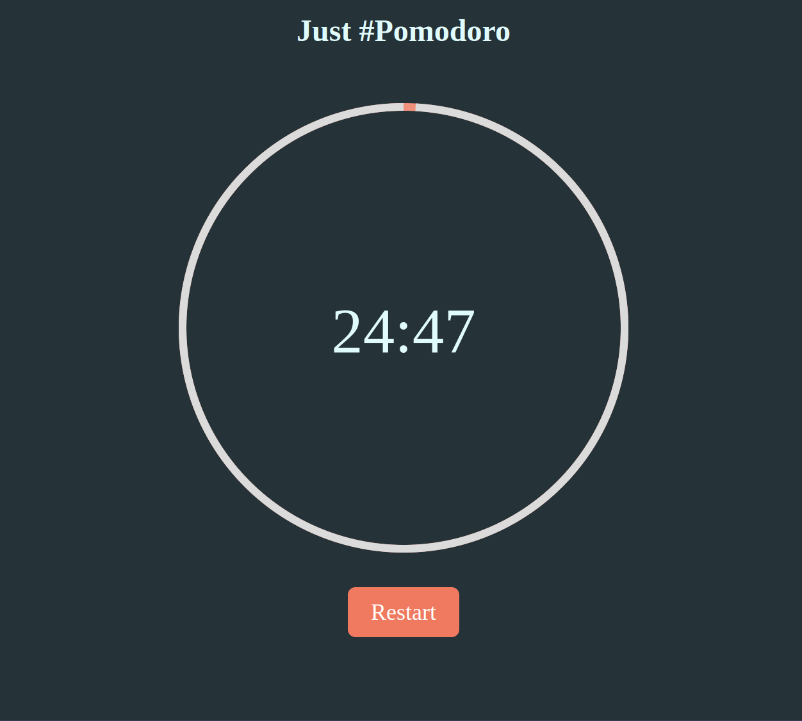

# Pomodoro Timer Application

## Description

The **Pomodoro Timer Application** is a time management tool built using **pure JavaScript**, HTML, and CSS

# Demo

## To do 

### Front-End (Web App)

- **Multiple Themes**  
  Toggle between **Light** and **Dark** themes for personalized user experience.

~~- **Break Session** 
  Customize short and long break sessions alongside the work sessions.~~

- **Session Tracking**  
  Keep track of sessions, tasks, and periods to monitor productivity.

- **Settings**  
  Adjust periods for work, short breaks, and long breaks.

### Back-End (Go Lang)

- **Data Storage**  
  Store session data in a database for later review.

- **Exporting Data**  
  Export session tracking data for analysis or reporting.

---
